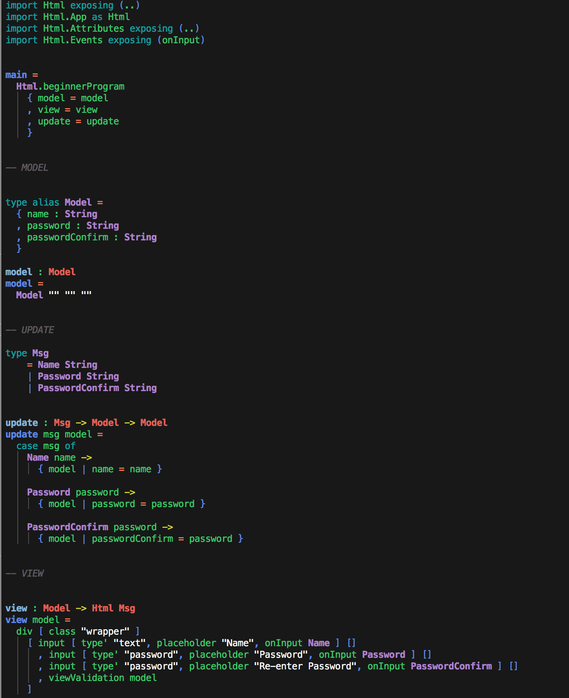

### [1. My WebStorm Elm Highlighting Config *]

### *USAGE:*
* Download the settings.jar file
* import the settings file by following the path 'File > Import Settings...'

* Thank you for your interest. :) *
